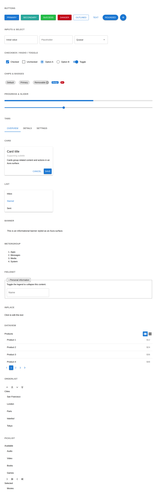
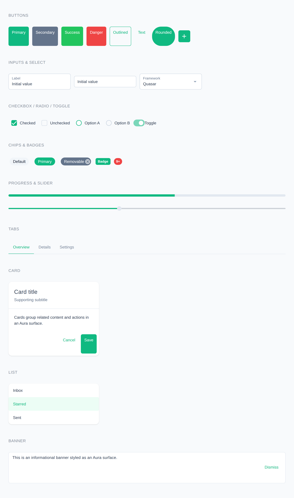
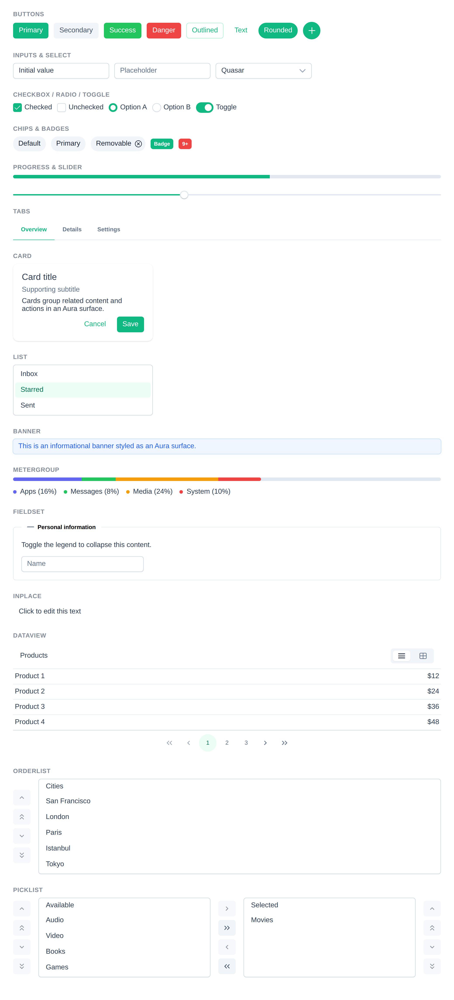
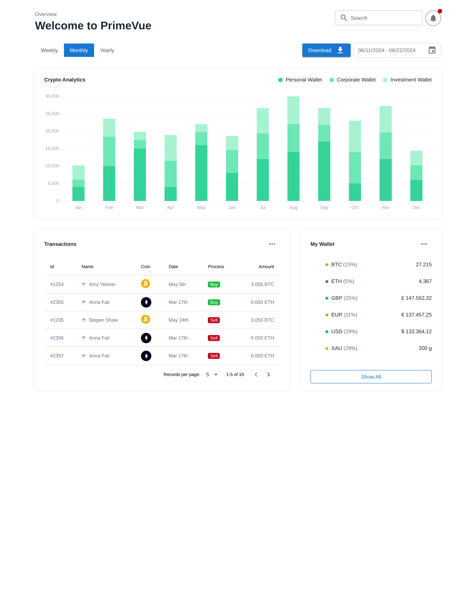
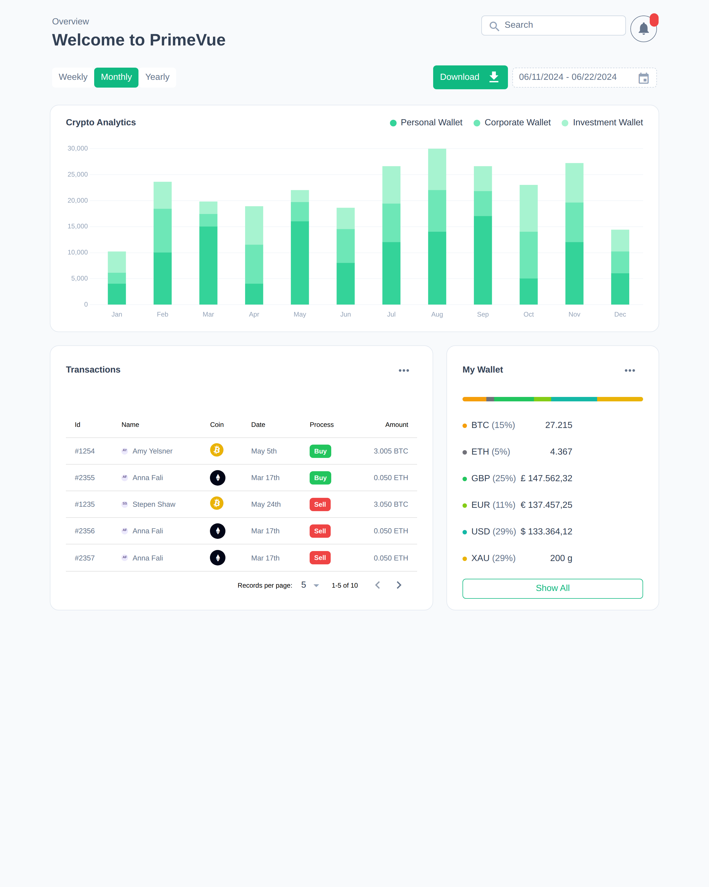
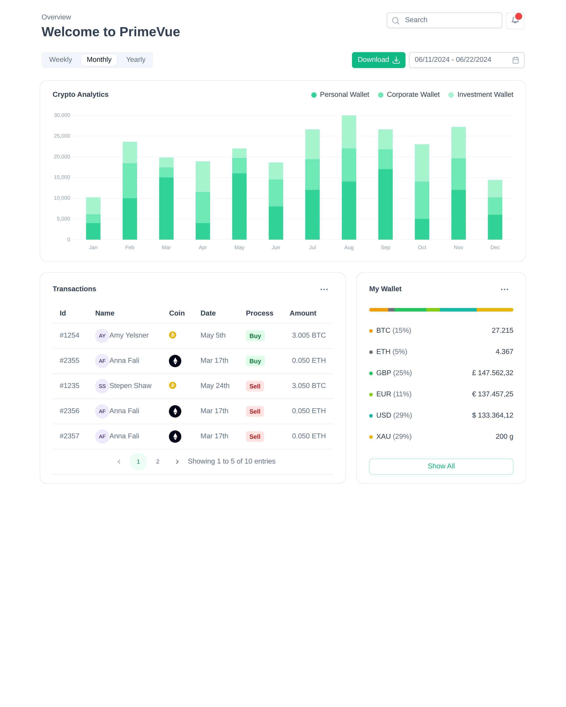

# quasar-app-extension-primevue-aura

A [Quasar](https://quasar.dev) [App Extension](https://quasar.dev/app-extensions/introduction)
that restyles Quasar's built-in components to match the
[PrimeVue v4 **Aura**](https://primevue.org/theming/styled/) theme — so a Quasar
app gets the clean PrimeVue look out of the box while you keep using Quasar's
`Qxxx` components and APIs.

> **Scope.** Phase 1 (App Extension scaffold) and Phase 2 (theming layer) restyle
> Quasar's own components to the Aura look. **Phase 3/4** add the PrimeVue
> components Quasar lacks (built on Quasar primitives) — see
> [`docs/COMPONENT-GAP-ANALYSIS.md`](docs/COMPONENT-GAP-ANALYSIS.md) for the full
> audit and [New components](#new-components-phase-34) below.

| Plain Quasar (Material) | This extension's Aura theme | Real PrimeVue v4 Aura (reference) |
| --- | --- | --- |
|  |  |  |

The middle image is Quasar's own components restyled by this extension; the
right image is upstream PrimeVue rendered with the same gallery, for comparison.

### Overview dashboard

A second playground mirrors PrimeVue's
[OverviewApp landing sample](https://github.com/primefaces/primevue/blob/master/apps/showcase/components/landing/samples/OverviewApp.vue)
as a full dashboard (header, time filter, bar chart, transactions table and a
wallet meter). It renders the same three ways, so the PrimeVue reference matches
the website, Quasar + Aura matches the reference, and plain Quasar stays as close
as Quasar's own components allow. The **Aura** preset is the only theme, but the
primary colour can be switched between Aura palettes via the playground nav.

| Plain Quasar (Material) | This extension's Aura theme | Real PrimeVue v4 Aura (reference) |
| --- | --- | --- |
|  |  |  |

## How it works

PrimeVue's design is driven by [design tokens](https://primevue.org/theming/styled/).
This extension reproduces the **Aura** preset's tokens as CSS custom properties
(`--p-*`) and maps Quasar's components and brand variables onto them:

- **`src/css/primevue/_tokens.scss`** — the full Aura token layer (primitive +
  semantic + per-component), generated from PrimeVue's own theming engine. The
  dark color scheme is bound to Quasar's `body.body--dark` selector, so toggling
  Quasar's [Dark plugin](https://quasar.dev/quasar-plugins/dark) flips the whole
  palette.
- **`src/css/_base.scss`** — remaps Quasar's brand variables (`--q-primary`,
  `--q-positive`, …) to the Aura semantic colours and sets global surfaces and
  typography.
- **`src/css/components/*`** — per-component overrides that align Quasar's
  shapes, spacing, borders, and focus styles with Aura.

Because the tokens are emitted by PrimeVue's engine, colours and dimensions stay
faithful to the upstream preset and can be regenerated on upgrade.

## Installation

```bash
quasar ext add primevue-aura
```

> The package is `quasar-app-extension-primevue-aura`; Quasar resolves the
> `primevue-aura` short name to it.

The index script registers the theme stylesheet automatically — no manual
imports required. To remove it:

```bash
quasar ext remove primevue-aura
```

### Dark mode

Enable Quasar's Dark plugin and the Aura dark palette is applied automatically:

```js
import { Dark } from 'quasar';
Dark.set(true); // or Dark.set('auto')
```

## Compatibility

- **Quasar:** built and verified against the Quasar **v2** (Vue 3) line. Quasar
  **v3** is not yet released; App Extensions are forward-compatible, and the
  `compatibleWith` range in `src/index.js` will be widened once v3 ships.
- **Vue:** 3.x.

## Notes / known differences

- The theme targets Quasar's **outlined** field variant (`outlined` prop) to
  match Aura's bordered inputs. Compact (~2.5rem) sizing is applied to
  label-less fields; fields with a floating `label` keep Quasar's taller control
  so the label-float animation still works.

## New components (Phase 3/4)

Some PrimeVue components have no Quasar equivalent. Following the
[gap analysis](docs/COMPONENT-GAP-ANALYSIS.md), this extension ships them as a
small Vue component library built **on top of Quasar primitives** (so they
inherit Quasar's behaviour/accessibility) and themed by the same Aura token
layer. The first iteration adds:

| Component | PrimeVue parity | Built on |
| --- | --- | --- |
| `MeterGroup` | multi-segment meter + legend | plain markup + QIcon |
| `Fieldset` | bordered group w/ optional collapse | QSlideTransition + QIcon |
| `Inplace` | click-to-edit display→editor swap | QBtn + slots |
| `DataView` | list/grid layout with paginator | QPagination |
| `OrderList` | reorderable list with controls | QList/QItem + QBtn |
| `PickList` | dual transfer list (source ⇄ target) | QList/QItem + QBtn |

They follow PrimeVue's prop/slot/event names where reasonable (documented in each
component's source where they diverge from Quasar conventions).

When the extension is installed, the components are registered globally via a
boot file — use them with their PascalCase names (e.g. `<Fieldset>`,
`<DataView>`). They can also be registered manually in any Vue 3 app:

```js
import QuasarAuraComponents from 'quasar-app-extension-primevue-aura/src/components';
app.use(QuasarAuraComponents);
```

## Development

This repo is both the published extension and a small static playground used to
capture the comparison screenshots above.

```bash
npm install

# Regenerate the Aura token layer from @primeuix/themes
npm run generate:tokens

# Build the playground (copies Vue/Quasar/PrimeVue UMD + fonts, compiles theme)
npm run playground
npx serve playground        # then open http://localhost:3000

# Regenerate docs/screenshots (needs: npx playwright install chromium)
npm run screenshots

# Compile the theme to dist/primevue-aura.css
npm run build:css

# Run the component unit tests (Vitest + @vue/test-utils)
npm test
```

The playground renders the **same** component gallery two ways:
`playground/index.html` is plain Quasar (attaching `playground/primevue-aura.css`
switches it to the Aura theme) and `playground/primevue.html` is the real
PrimeVue v4 Aura components for reference. `playground/components.html` demos the
new components from [Phase 3/4](#new-components-phase-34). A second playground —
`playground/dashboard.html` (Quasar, with a nav toggle for the Aura theme) and
`playground/dashboard.primevue.html` (real PrimeVue) — mirrors PrimeVue's
OverviewApp dashboard sample and lets you switch the Aura primary colour. See
[`tools/README.md`](tools/README.md) for the full screenshot workflow.

## License

[MIT](LICENSE) © Mylonics. PrimeVue and the Aura preset are © PrimeTek,
distributed under the MIT license; this project reproduces the Aura *design
tokens* to theme Quasar and bundles no PrimeVue component code.
